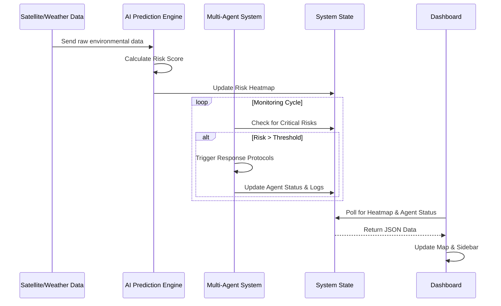

# 🎨 System Design: AI Disaster Intelligence System

## 1. High-Level Architecture
The system follows a **Closed-Loop Control Architecture** consisting of three main layers:

### A. The Sensing Layer (Input)
*   **Simulated Sensors**: Generates mock data for Soil Moisture, Rainfall Intensity, and Elevation.
*   **Prediction Engine**: A Python-based service that processes sensor data to output a `RiskMap`.

### B. The Decision Layer (Core Logic)
*   **Multi-Agent Orchestrator**: A central hub that receives `RiskMap` updates.
*   **Agent Logic**:
    *   *Rescue Agent* uses proximity logic to assign teams.
    *   *Route Agent* uses Dijkstra/A* algorithms to find unblocked paths.
    *   *Medical Agent* uses load-balancing logic for hospital beds.

### C. The Interface Layer (Presentation)
*   **React Frontend**: Polls the backend for state updates.
*   **Leaflet Map**: Renders logical coordinates onto a visual geographical map.

## 2. Data Flow Diagram



## 3. Component Design

### Backend (FastAPI)
*   `main.py`: Entry point, defines API endpoints (`/predict-flood`, `/agent-status`).
*   `prediction_engine.py`: Class responsible for generating the grid and calculating risk.
*   `agents.py`: Defines `DisasterAgent` class and `MultiAgentSystem` logic.

### Frontend (React)
*   `App.jsx`: Main layout container.
*   `MapComponent.jsx`: Handles map rendering, markers, and zone overlays.
*   `DashboardStatus.jsx`: Sidebar component for displaying logs and agent lists.
*   `api.js`: Abstraction layer for HTTP requests.

## 4. Database Schema (Conceptual/In-Memory)

**RiskZone Object**:
```json
{
  "lat": 12.97,
  "lon": 77.59,
  "risk": {
    "score": 85,
    "level": "CRITICAL",
    "action": "EVACUATE"
  }
}
```

**Agent Object**:
```json
{
  "id": "uuid-1234",
  "type": "RESCUE",
  "name": "Rescue-Alpha",
  "status": "WORKING",
  "location": {"lat": 12.98, "lon": 77.60},
  "current_task": "Deploy to Zone 4"
}
```

## 5. UI/UX Design Philosophy
*   **Dark Mode**: Reduces eye strain in command center environments.
*   **Glassmorphism**: Provides a modern, high-tech aesthetic suitable for "Future Tech" hackathons.
*   **Color Semantics**: 
    *   🔴 **Red**: Critical Danger / Active Response.
    *   🟡 **Yellow**: Warning / Standby.
    *   🟢 **Green**: Safe / Idle.
